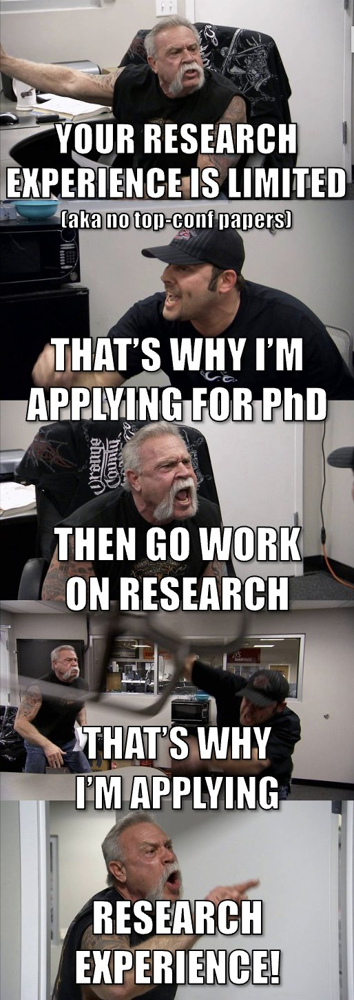

# How not to do PhD application

I applied for PhD programs in computer science in the US for Fall 2024. Throughout the whole application process, I feel like I made a lot of mistakes. This is where I share my journey, what I think I did right, reflect on the mistakes and what I would have done differently if I were to go throught it again (I am really happy and lucky that I don't have to go through it again 🥶)

***Note***: *Since I am from CS background, most of the things might only be relevant if you are also from CS. But some of them are generic. Be sure to take anything you read here with a grain of salt.*

> "*It takes a wise man to learn from his mistakes, but an even wiser man to learn from others' mistakes*" - some random dude on the internet

### To apply or not to apply

This is one of the biggest dillema that everyone face. If you are still not sure whether you should pursue a PhD or not, then there's not a lot of help that I can offer to be honest. You probably have to ask yourself a lot of questions to be fully sure. But I can share my story. For me, it was a lot of soul searching. Initially, I didn't want to pursue graduate school. Of course after years of going through Bangladeshi academia, I developed a certain level of hatred towards formal education. I didn't want to continue memorizing stuffs for exams forever. So, doing a PhD was initially a big *NO* for me. But after graduating and spending some time in the industry, I had a change of heart. I realized that I didn't want to become a classic Software Engineer for the rest of my life as much as the least effort route it would be for me. The kind of problems that interested me were a bit different. I figured out I need to become a Research Scientist to work on those problems. And you gotta have a PhD to become one. Goddamn it academia, I am back :-(

If you are one of those persons who wants to do a PhD just to relocate to USA, then thats a different story :-) 

<!-- TLDR: Just make sure you enjoy doing research and have the will to survive :-) -->

### To wait or not to wait

So now you are sure that you do want a PhD. *But when should you apply?* Should you apply immediately? or should you wait it out till you have a "strong" profile. While the actual answer depends on your exact circumstances and your subfield of research, the general answer for me is to apply immediately when you are sure and have a sufficiently good profile that you are confident about, specially if you are into super competitive ML fields like CV (Computer Vision) and NLP (Natural Language Processing). As to whether you have a sufficient good profile or not, the best way is to ask a few of your seniors for opinions; those who has gone through the process and has a good idea about the research landscape of your subfield.

The rate at which the ML subfields are progressing is simply mind boggling and is very difficult to keep up unless of course you are already associated with big labs or have gazzilion flops casually lying around your basement. What you consider a good profile for this season, might be cosnidered below average for the next season. With top machine learning conferences receiving over 10,000 paper submissions each year and accepting a few thousand, the situation is only going to worsen as high school students are also [joining the party](https://twitter.com/NeurIPSConf/status/1778767375791239442). I know I might sound depressing, but having been going through the process, stalking a hella lot of students, and seen a lot of applicants' profile on discord and reddit, I can tell you that the competition is fierce. So, if you are sure that you want to do a PhD, then apply immediately. You can always reapply if you don't get in. But if you wait, you might be too late.

***TLDR***: Go for it. You will never be good enough :-)

### When to start preparing

Start very early. I can't stress this enough. I started preparing for my applications very late. By the time I was done shorlisting universities and professors, it was already early November. When I started mailing professors, I almost got no reply. Of course I won't. Because a ton of students like me mail during that time and the professors don't reply because they are overwhelmed. The correct time to start mailing is in August. My friends who had a very successful run this season started mailing professors during that time. They got replies, and even had early interviews. If you are getiing interviews that early, and it goes well, you have gotten yourself into a very strong position even before the application deadline. You can consider those as "safe shots" and this can give you room for applying to more ambitious schools.

### Should you give GRE?

***(I am strictly speaking from CS perspective here)***

If you are applying for MS, then you should definitely give GRE. Most universities require it. But if you are applying for PhD, then it depends. Some universities require it, some don't. Some universities say it's optional. Post COVID, most top schools (I'm talking about top 50) don't require it. There are some exceptions. Like CMU MLD requires GRE. So, be sure to check the requirements of your intended programs.

As to how important GRE is, even if it is optional, it depends on your profile. If you have adequate research experience, then GRE actually doesn't matter that much (my personal take, please do your own research).

### What ranking / universities to aim for

My research experience was mainly in Computer Vision. Plus I also had NLP background from projects and competitions. My research interest is in vision-language or multimodal learning. Doing a bit of research, I found that this kind of work was mainly done in NLP labs. So, I mainly applied to NLP programs.

Now when it comes to shortlisting, this is where I made one of my biggest mistakes. I mainly followed [US News (CS) Ranking](https://www.usnews.com/best-graduate-schools/top-science-schools/computer-science-rankings?_sort=rank-asc) and [csrakings.org](https://csrankings.org/#/index?all&us). But for very weird reason, I didn't check the NLP subranking. I mainly focused on the overall ranking. Somehow, it just slipped my mind. I was mainly looking at the top 50 schools from the ranks above. So, I had a few schools from 1-10, a lot in 11-30, and a few in 31-50. I was totally oblivious to the fact that some schools might be very good in NLP but not in the overall ranking. I just went through the NLP labs from the overall ranking and shortlisted those ones that had interesting works for me. Some time later after the application deadline, I got into a global discord server for CS Fall 24, where I met a lot of other applicants. One day, I was listing to a conversation of which schools are good for NLP, and which are the top 10s. I was like "Oh no, I applied to a lot of them". Then I checked the NLP subranking of CS Rankings. Boy, I was in for a surprise. I apparently applied to 6 of the top 10, and 11 of the top 20 NLP schools. I instantly understood that it was Joeover. I should have applied to more schools in the 20-50 range.

Now, the definition of strong profile is very subjective. Depends on what ranking you are aiming for. But if you are aiming for top 10 schools in CV/NLP, then you should have at least 1-2 first author papers in top tier conferences like CVPR, NeurIPS, ICML, ICLR, ACL, EMNLP, etc. If you don't have that, then you should have a very strong recommendation letter from someone who is quite known in the field. Having either or both of them doesn't guarantee you an admit, but puts you in a much better position than others. I know it defies the whole point of doing a PhD, but this is the reality check that I got during my application process.

If you are not aiming for top 10 schools or in any other field, then the requirements might be different. But having some research experience is always a plus. It doesn't have to be a publication. It can be a research internship, a research project, a research assistantship, etc. It shows that you have some idea about what you are getting into. It also helps you to get a good recommendation letter. And recommendation letters are very important. I will talk about it later.

### Whom to take LORs from