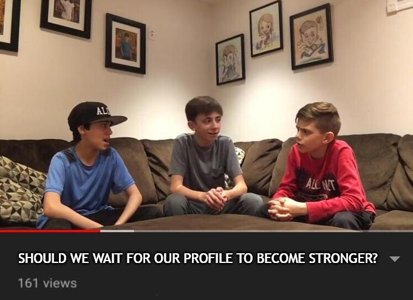

# How not to do PhD application

The quickest way to learn anything is to learn from others' mistakes. There's this saying - "*It takes a wise man to learn from his mistakes, but an even wiser man to learn from others' mistakes*".

I applied for PhD programs in computer science in the US for Fall 2024. Throughout the whole application process, I made a shit ton of mistakes. Here I reflect on those and what I would have done differently if I were to go throught it again (I am really happy and lucky that I don't have to go through it again 🥶)

> ***Note***: *Since I am from CS background, some of the things might only be relevant if you are also from CS. But most of them are generic. Be sure to take anything you read here with a grain of salt.*

### To apply or not to apply

This is one of the biggest dillema that everyone face. If you are still not sure whether you should pursue a PhD or not, then there's not a lot of help that I can offer to be honest. You probably have to ask yourself a lot of questions to be fully sure. But I can share my journey. For me, it was a lot of soul searching. Initially, I didn't want to pursue graduate school. Of course after years of going through Bangladeshi academia, I developed a certain level of hatred towards formal education. I didn't want to continue memorizing stuffs for exams. So, doing a PhD was a big no for me initially. But after graduating and spending some time in the industry, I had a change of heart. I realized that I didn't want to become a classic Software Engineer for the rest of my life as much as the least effort route it would be for me. The kind of problems that interested me were a bit different. I figured out I need to become a Research Scientist to work on those problems. And you gotta have a PhD to become one. Goddamn it academia, I am back to you again.

So now you are sure that you do want a PhD. But when should you apply? Should you apply immediately? or should you wait it out till you have a "strong" profile. While the actual answer depends on your exact circumstances, the general answer for me is to apply immediately when you are sure, specially if you are into super competitive ML fields like CV (Computer Vision) and NLP (Natural Language Processing). The rate at which these fields are progressing is simply mind boggling and is very difficult to keep up unless of course you are already associated with big labs or have gazzilion flops casually lying around your basement. What you consider a good profile for this season, might be cosnidered below average for the next season. With top machine learning conferences receiving over 10,000 paper submissions each year and accepting a few thousand, the situation is only going to worsen as high school students are also [joining the party](https://twitter.com/NeurIPSConf/status/1778767375791239442).

